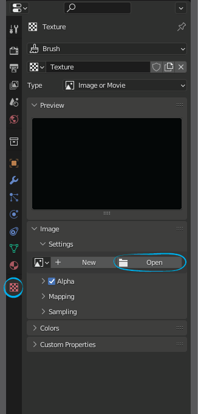
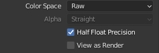
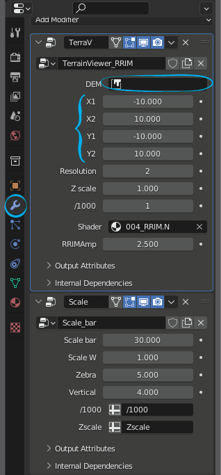
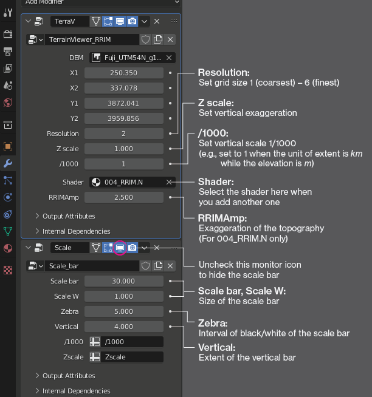

# DEM Viewer
### What is DEM Viewer?

DEM Viewer is an application to display 3D elevation maps on blender. This application provides a higher degree of freedom and enables users to output higher quality map images than other GIS software by utilizing the features of the graphics software. 

### Files
TerrainViewer_V2.21.blend — Blender file packing geometry nodes (TerrainViewer_RRIM and Scale_bar) and shader (004_RRIM.N). No add-on is required; simply open this file and import your tif.

TerrainViewer_V2.21_Sample.blend — A sample DEM (2.98MB) is packed. Download this file to try the application.

### Manual
#### ⚠DEM Viewer is only compatible with Blender 3.2 & above.
#### 0. Prepare a proper DEM file
■ .tif format

■ meter unit (not latitude & longitude)

■ Does not include NODATA value (set nodata value to 0 using GIS software beforehand)

■ Save the extent of the map

#### 1. Import DEM

In the right frame, select [Texture] (checker icon) -> [Open]

Set [Color Space] -> [Raw]

#### 2. Display DEM

Move to [Modifier Properties] (spanner icon) -> Click the black form denoted [DEM] -> select the imported DEM file

Adjust the map extent: X1: western end, X2: eastern end, Y1, southern end, Y2: northern end

When the map is out of the sight, press [Home] key.

#### 3. Display adjustment

### Acknowledgments

The built-in shader in TerrainViewer_V2.2.blend refers to the coloring method of Red Relief Image Map by [Chiba et al. (2008)](https://www.researchgate.net/publication/237517308_Red_relief_image_map_New_visualization_method_for_three_dimensional_data?enrichId=rgreq-848eb691f8c036d409d8257488d6e5f7-XXX&enrichSource=Y292ZXJQYWdlOzIzNzUxNzMwODtBUzoyMzE1NDE0NTY1MDI3ODRAMTQzMjIxNTE5MzYxNg%3D%3D&el=1_x_2&_esc=publicationCoverPdf).

The sample DEM data contained in TerrainViewer_V2.2_Sample.blend is a 100 m grid DEM produced after downsampling [1 arc-sec. SRTM DEM](https://www2.jpl.nasa.gov/srtm/).
