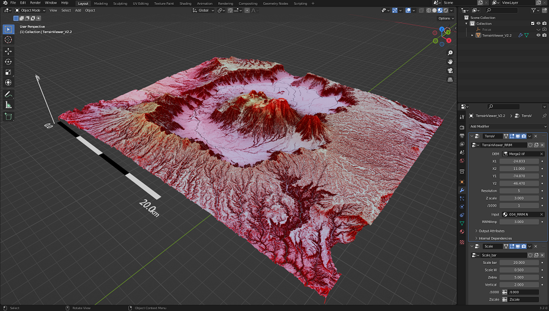

# DEMViewer
### What is DEM Viewer?

DEM Viewer is an application to display 3D elevation maps on blender. This application provides a higher degree of freedom and enables users to output higher quality map images than other GIS software by utilizing the features of the graphics software. 

### Acknowledgments

The built-in shader in TerrainViewer_V2.2.blend refers to the coloring method of Red Relief Image Map by Chiba et al. (2008).

The sample DEM data contained in TerrainViewer_V2.2_Sample.blend is a 100 m grid DEM produced after downsampling 1 arc-sec. SRTM DEM.
